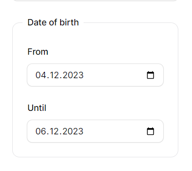

# Filament easy date-range Filter

A easy-use date-range filter to [Filament](https://filamentphp.com)

Maked from [Filament Advanced Filter](https://github.com/webbingbrasil/filament-advancedfilter)

> **Note**
> Only for **Filament 3.x**

## Installation

Install the package via composer (requires filament >= 3.x)
```bash
composer require shemyart/filament-date-range:3.x-dev
```

Optionally you can publish the translation files

```php 
php artisan vendor:publish --tag="filament-date-range-translations"
```

## Available Filters

### DateFilter

Filter records by date/timestamp column:

```php
use Shemyart\DateRangeFilament\Filters\DateFilter;

DateFilter::make('date_of_birth')
```

This filter allows users to search records in range of dates




## Credits

- [Danilo Andrade](https://github.com/dmandrade)
- [All Contributors](https://github.com/webbingbrasil/filament-advancedfilter/contributors)

- [Artem Shemyakin](https://github.com/Shemyart)
- [All Contributors](https://github.com/Shemyart/filament-date-range/contributors)
## License

The MIT License (MIT). Please see [License File](LICENSE.md) for more information.
